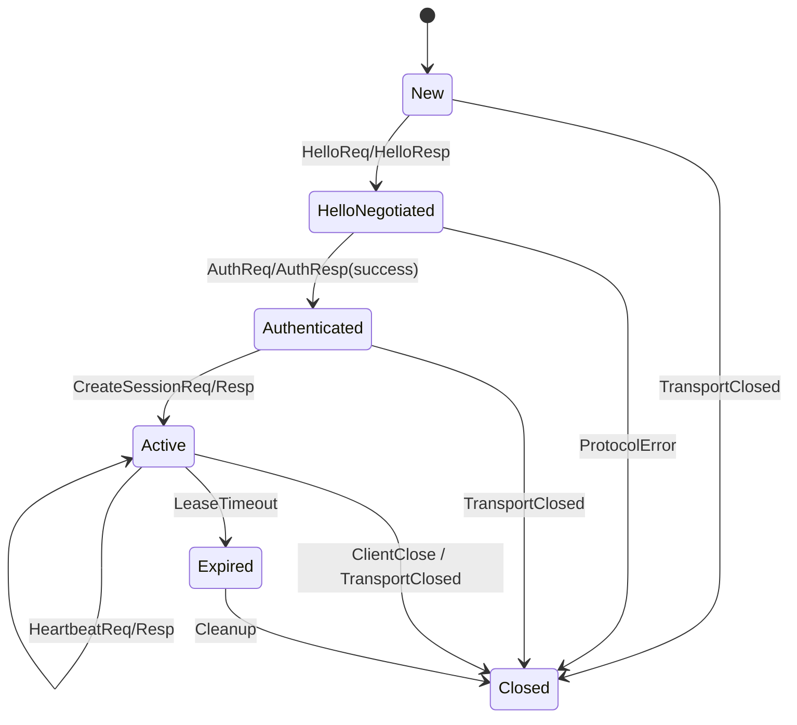
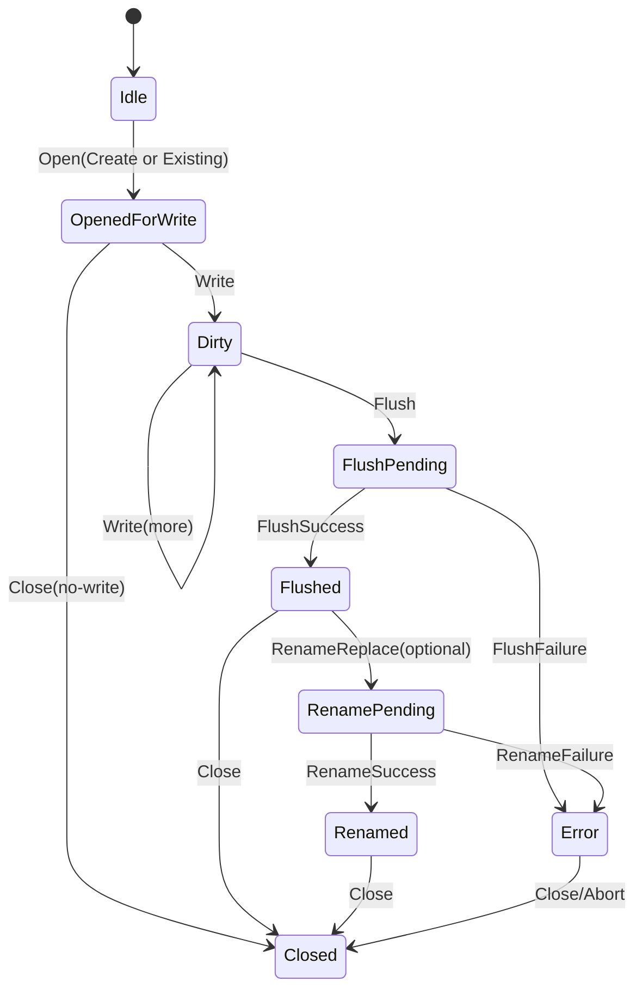
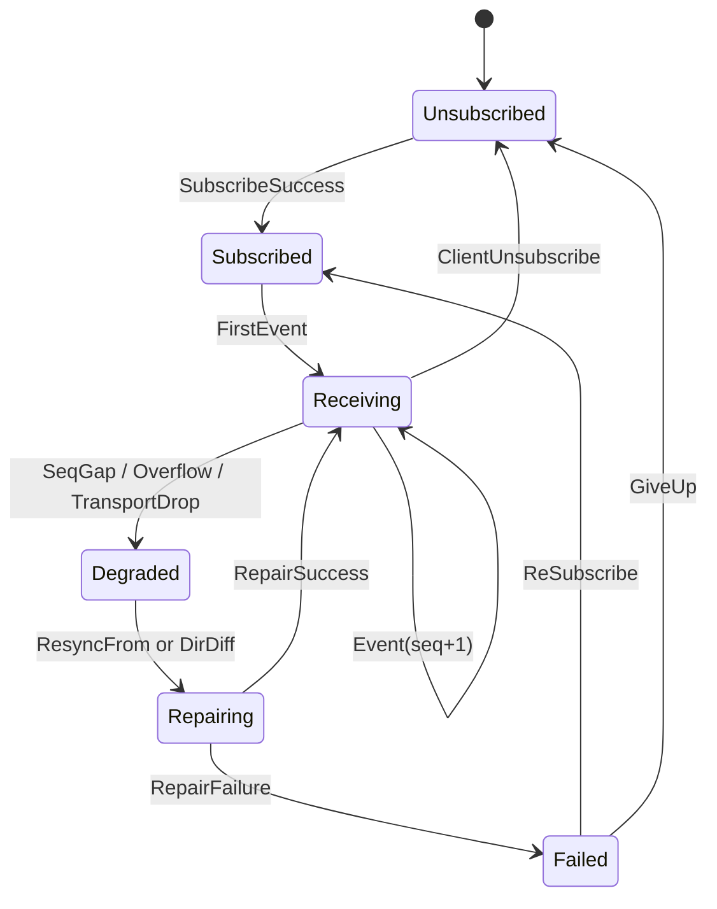

# State Machines

## 1. Session State Machine

```mermaid
stateDiagram-v2
    [*] --> New
    New --> HelloNegotiated: HelloReq/HelloResp
    New --> Closed: TransportClosed
    HelloNegotiated --> Authenticated: AuthReq/AuthResp(success)
    HelloNegotiated --> Closed: ProtocolError
    Authenticated --> Active: CreateSessionReq/Resp
    Authenticated --> Closed: TransportClosed
    Active --> Active: HeartbeatReq/Resp
    Active --> Expired: LeaseTimeout
    Active --> Closed: ClientClose / TransportClosed
    Expired --> Closed: Cleanup
```

## 2. Save Flow State Machine

```mermaid
stateDiagram-v2
    [*] --> Idle
    Idle --> OpenedForWrite: Open(Create or Existing)
    OpenedForWrite --> Dirty: Write
    OpenedForWrite --> Closed: Close(no-write)
    Dirty --> Dirty: Write(more)
    Dirty --> FlushPending: Flush
    FlushPending --> Flushed: FlushSuccess
    FlushPending --> Error: FlushFailure
    Flushed --> RenamePending: RenameReplace(optional)
    Flushed --> Closed: Close
    RenamePending --> Renamed: RenameSuccess
    RenamePending --> Error: RenameFailure
    Renamed --> Closed: Close
    Error --> Closed: Close/Abort
```

## 3. Watch Recovery State Machine

```mermaid
stateDiagram-v2
    [*] --> Unsubscribed
    Unsubscribed --> Subscribed: SubscribeSuccess
    Subscribed --> Receiving: FirstEvent
    Receiving --> Receiving: Event(seq+1)
    Receiving --> Degraded: SeqGap / Overflow / TransportDrop
    Receiving --> Unsubscribed: ClientUnsubscribe
    Degraded --> Repairing: ResyncFrom or DirDiff
    Repairing --> Receiving: RepairSuccess
    Repairing --> Failed: RepairFailure
    Failed --> Subscribed: ReSubscribe
    Failed --> Unsubscribed: GiveUp
```
